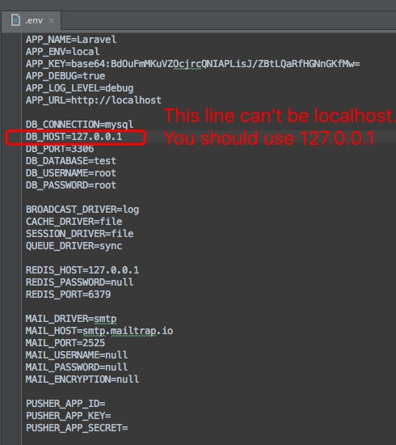
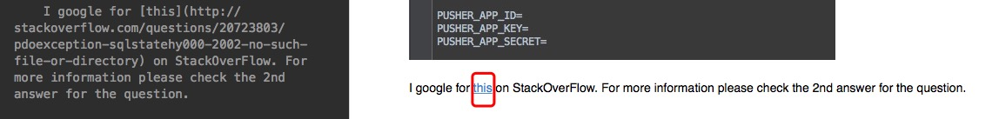

# Run a laravel
Happy coding.

1. Purpose and Preparations

   <b>Purpose for make [moco-server](https://github.com/dreamhead/moco) more flexible for data-response dynamically</b>
  
	+ Setup Php environment.  
	+ Download and install [Composer](https://getcomposer.org/)  
	+ Set ~/.composer/vendor/bin to the $PATH in bash_profile or bashrc. // You can use laravel command
	+ Download and install MySQL.
	+ Get your favourite text-editor. (Sublime Text, VIM, Emacs, Nano)  

2. Create a new php-laravel project  

	`laravel new project`  // This will automatically create all essential files and libs.
	
	That's all. Your laravel project has been created.  
	
3. Attentions for .gitignore  

	If you're using git to organize the source code, you'd better check the <b>.env</b> file in .gitignore because the original .gitignore automatically ignore .env file by default. These are my most used folders when I'm learning.
	  
	
4. Start laravel  

	`php artisan serve`   // That's all. You can acess the target page in web-browser now.
	
	During the developing, you can add new files (controller, model) using php artisan command like this. 
	
	`php artisan make:controller AdminController`  
	
	`php artisan make:model User`
	

  
  
  
The problems I had met when I was learning php from the [Offical API Website](https://laravel.com/docs/5.4).

1. DB-Config:  .env in Laravel 5.4 
 
   
 
    I google for [this](http://stackoverflow.com/questions/20723803/pdoexception-sqlstatehy000-2002-no-such-file-or-directory) on StackOverFlow. For more information please check the 2nd answer for the question.
    
2. Markdown syntax:  README.md  

  
The README.md is ok from my local machine, but it was not as good as I had expected on the Github page.  

3. Trending within spring-boot and laravel

   [Trending for php-laravel and java-spring-boot](https://stackshare.io/stackups/laravel-vs-spring-boot)  
   

4. Summary of comparison

   
